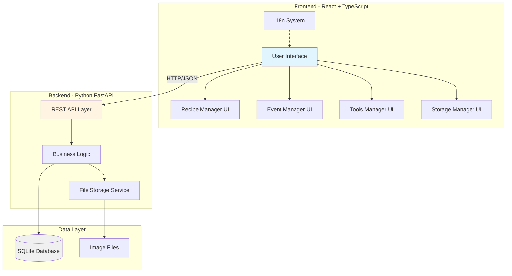
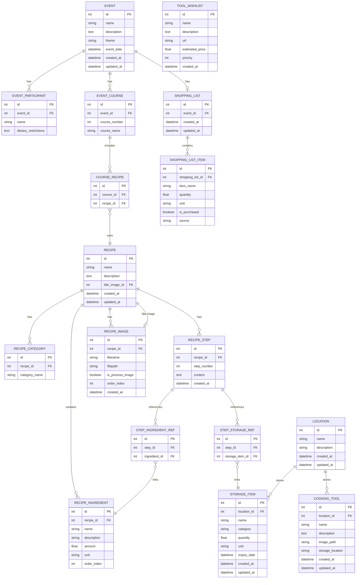
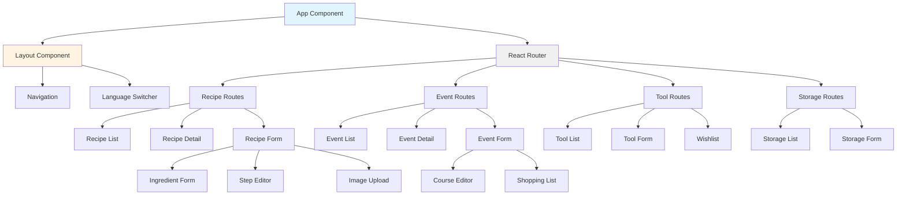

# Cookies Support System - Architecture Plan

## Project Overview

A comprehensive cooking management system with four main components:
- **Recipe Manager**: Manage recipes with ingredients, steps, images, and categories
- **Event Manager**: Plan cooking events with courses, recipes, and shopping lists
- **Cooking Tools Manager**: Track cooking tools and equipment across locations
- **Base Storage Manager**: Manage herbs, flavors, and supplies across locations

## Technology Stack

### Backend
- **Language**: Python 3.11+
- **Framework**: FastAPI (modern, async, automatic API documentation)
- **Database**: SQLite with SQLAlchemy ORM
- **File Storage**: Local filesystem for images
- **API Style**: RESTful JSON API

### Frontend
- **Framework**: React 18+ with TypeScript
- **Styling**: Tailwind CSS
- **State Management**: React Context API + React Query
- **Internationalization**: react-i18next
- **Routing**: React Router v6
- **HTTP Client**: Axios
- **Form Handling**: React Hook Form
- **Image Upload**: Custom component with preview

### Development Tools
- **Backend**: Poetry for dependency management, Black for formatting, Pytest for testing
- **Frontend**: Vite for build tooling, ESLint + Prettier for code quality
- **Version Control**: Git

## System Architecture



## Database Schema



## API Endpoints Structure

### Recipe Manager API
- `GET /api/recipes` - List all recipes
- `GET /api/recipes/{id}` - Get recipe details
- `POST /api/recipes` - Create new recipe
- `PUT /api/recipes/{id}` - Update recipe
- `DELETE /api/recipes/{id}` - Delete recipe
- `POST /api/recipes/{id}/images` - Upload recipe image
- `DELETE /api/recipes/{id}/images/{image_id}` - Delete recipe image
- `PUT /api/recipes/{id}/title-image` - Set title image
- `GET /api/categories` - List all categories

### Event Manager API
- `GET /api/events` - List all events
- `GET /api/events/{id}` - Get event details
- `POST /api/events` - Create new event
- `PUT /api/events/{id}` - Update event
- `DELETE /api/events/{id}` - Delete event
- `GET /api/events/{id}/shopping-list` - Get shopping list
- `POST /api/events/{id}/shopping-list/items` - Add shopping list item
- `PUT /api/events/{id}/shopping-list/items/{item_id}` - Update item
- `DELETE /api/events/{id}/shopping-list/items/{item_id}` - Delete item

### Cooking Tools Manager API
- `GET /api/tools` - List all tools
- `GET /api/tools/{id}` - Get tool details
- `POST /api/tools` - Create new tool
- `PUT /api/tools/{id}` - Update tool
- `DELETE /api/tools/{id}` - Delete tool
- `GET /api/tools/wishlist` - List wishlist items
- `POST /api/tools/wishlist` - Add to wishlist
- `PUT /api/tools/wishlist/{id}` - Update wishlist item
- `DELETE /api/tools/wishlist/{id}` - Delete wishlist item

### Base Storage Manager API
- `GET /api/storage` - List all storage items
- `GET /api/storage/{id}` - Get storage item details
- `POST /api/storage` - Create new storage item
- `PUT /api/storage/{id}` - Update storage item
- `DELETE /api/storage/{id}` - Delete storage item
- `POST /api/storage/check-availability` - Check ingredient availability
- `POST /api/storage/add-to-shopping-list` - Add missing items to shopping list

### Locations API
- `GET /api/locations` - List all locations
- `POST /api/locations` - Create new location
- `PUT /api/locations/{id}` - Update location
- `DELETE /api/locations/{id}` - Delete location

## Frontend Component Structure



## Key Features Implementation

### 1. Multi-language Support
- Use `react-i18next` for internationalization
- Translation files: `locales/en.json` and `locales/de.json`
- Language switcher in navigation bar
- Store language preference in localStorage

### 2. Image Management
- Upload images to backend via multipart/form-data
- Store images in `backend/uploads/recipes/` and `backend/uploads/tools/`
- Generate thumbnails for list views
- Support drag-and-drop image upload
- Image gallery with lightbox for viewing

### 3. Recipe Step References
- Autocomplete component for ingredient selection
- Autocomplete component for storage item selection
- Visual indicators for referenced items
- Automatic shopping list generation for missing items

### 4. Shopping List Integration
- Automatically add missing ingredients when creating event
- Check storage availability before adding to shopping list
- Mark items as purchased
- Export shopping list (print/PDF)

### 5. Safari Optimization
- Use `-webkit-` prefixes where needed
- Test touch interactions
- Optimize for iOS safe areas
- Use native iOS form controls where appropriate
- PWA support for home screen installation

### 6. Responsive Design
- Mobile-first approach
- Breakpoints: sm (640px), md (768px), lg (1024px), xl (1280px)
- Touch-friendly UI elements (minimum 44x44px tap targets)
- Swipe gestures for mobile navigation

## Project Structure

```
cooking-management-system/
├── backend/
│   ├── app/
│   │   ├── __init__.py
│   │   ├── main.py
│   │   ├── config.py
│   │   ├── database.py
│   │   ├── models/
│   │   │   ├── __init__.py
│   │   │   ├── recipe.py
│   │   │   ├── event.py
│   │   │   ├── tool.py
│   │   │   ├── storage.py
│   │   │   └── location.py
│   │   ├── schemas/
│   │   │   ├── __init__.py
│   │   │   ├── recipe.py
│   │   │   ├── event.py
│   │   │   ├── tool.py
│   │   │   └── storage.py
│   │   ├── routers/
│   │   │   ├── __init__.py
│   │   │   ├── recipes.py
│   │   │   ├── events.py
│   │   │   ├── tools.py
│   │   │   ├── storage.py
│   │   │   └── locations.py
│   │   └── services/
│   │       ├── __init__.py
│   │       ├── file_service.py
│   │       └── shopping_list_service.py
│   ├── uploads/
│   │   ├── recipes/
│   │   └── tools/
│   ├── tests/
│   ├── pyproject.toml
│   └── README.md
├── frontend/
│   ├── public/
│   ├── src/
│   │   ├── components/
│   │   │   ├── common/
│   │   │   ├── recipes/
│   │   │   ├── events/
│   │   │   ├── tools/
│   │   │   └── storage/
│   │   ├── pages/
│   │   ├── hooks/
│   │   ├── services/
│   │   ├── contexts/
│   │   ├── locales/
│   │   │   ├── en.json
│   │   │   └── de.json
│   │   ├── types/
│   │   ├── utils/
│   │   ├── App.tsx
│   │   ├── main.tsx
│   │   └── i18n.ts
│   ├── package.json
│   ├── tsconfig.json
│   ├── tailwind.config.js
│   └── vite.config.ts
├── docs/
│   ├── API.md
│   ├── USER_GUIDE_EN.md
│   └── USER_GUIDE_DE.md
└── README.md
```

## Development Workflow

### Phase 1: Backend Foundation
1. Set up Python project with Poetry
2. Create database models
3. Implement SQLAlchemy relationships
4. Create Pydantic schemas for validation
5. Build API endpoints with FastAPI
6. Implement file upload service
7. Add CORS middleware for frontend

### Phase 2: Frontend Foundation
1. Set up React + TypeScript + Vite project
2. Configure Tailwind CSS
3. Set up i18n with react-i18next
4. Create routing structure
5. Build common UI components
6. Set up API client with Axios
7. Implement React Query for data fetching

### Phase 3: Feature Implementation
1. Recipe Manager (backend + frontend)
2. Event Manager (backend + frontend)
3. Cooking Tools Manager (backend + frontend)
4. Base Storage Manager (backend + frontend)
5. Cross-component integrations

### Phase 4: Polish & Testing
1. Safari-specific optimizations
2. Responsive design refinements
3. Error handling and validation
4. Performance optimization
5. End-to-end testing
6. Documentation

## Testing Strategy

### Backend Testing
- Unit tests for models and services
- Integration tests for API endpoints
- Test database fixtures
- Coverage target: 80%+

### Frontend Testing
- Component tests with React Testing Library
- Integration tests for user flows
- E2E tests with Playwright
- Visual regression tests

### Browser Testing
- Safari on iOS (iPhone, iPad)
- Safari on macOS
- Chrome (fallback testing)
- Firefox (fallback testing)

## Deployment Considerations

### Backend Deployment
- Docker container with Python + SQLite
- Environment variables for configuration
- Volume mount for database and uploads
- Health check endpoint

### Frontend Deployment
- Static build with Vite
- CDN deployment (Netlify, Vercel, or similar)
- Environment-specific API URLs
- PWA manifest for iOS installation

## Security Considerations

1. **Input Validation**: Pydantic schemas for all API inputs
2. **File Upload**: Validate file types and sizes
3. **SQL Injection**: Use SQLAlchemy ORM (parameterized queries)
4. **CORS**: Configure allowed origins
5. **Rate Limiting**: Implement for API endpoints
6. **Error Handling**: Don't expose internal errors to client

## Performance Optimization

1. **Database**: Add indexes on frequently queried fields
2. **Images**: Generate and serve thumbnails
3. **API**: Implement pagination for list endpoints
4. **Frontend**: Code splitting and lazy loading
5. **Caching**: Use React Query cache for API responses
6. **Bundle Size**: Tree shaking and minification

## Future Enhancements

1. User authentication and authorization
2. Recipe sharing and import/export
3. Meal planning calendar
4. Nutrition information tracking
5. Recipe scaling (adjust serving sizes)
6. Print-friendly recipe cards
7. Voice-guided cooking mode
8. Barcode scanning for inventory
9. Cloud sync across devices
10. Recipe recommendations based on available ingredients